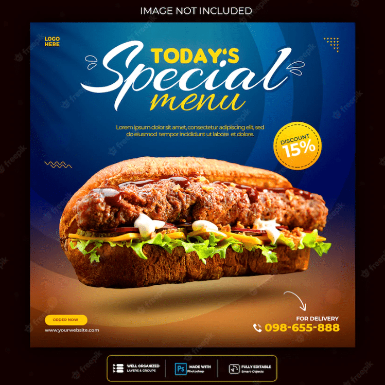

# 🍔 FastFood Menu Advertisement Web 🥤

> **Dự án:** Quản lý & quảng cáo thực đơn cho nhà hàng FastFood với giao diện hiện đại, hệ thống phân quyền, quản trị và bảo mật.

---

## 📁 Cấu trúc thư mục

```
.
├── 52200271_NguyenCongToan.docx         # Báo cáo đồ án (Word)
├── 52200271_NguyenCongToan.pdf          # Báo cáo đồ án (PDF)
├── sql phụ được thêm nếu web_sqli.sql lỗi/
│    └── ...                             # Các script SQL phụ trợ
├── web_sqli.sql                         # Cơ sở dữ liệu chính
└── web_mysqli/
    ├── admincp/                         # Trang quản trị (Admin Control Panel)
    │    ├── config/
    │    ├── css_admin/
    │    ├── modules/
    │    ├── login.php                   # Đăng nhập cho admin
    │    └── index.php                   # Giao diện dashboard cho admin
    └── view/
         ├── css/                        # File style CSS
         ├── images/                     # Hình ảnh menu, quảng cáo
         ├── pages/
         └── index.php                   # Giao diện người dùng cuối
```

---

## 🏗️ Công nghệ sử dụng

-  (mysqli)
- 
- 
- 
- 
- 
- 

---

## 🔑 Các chức n��ng chính

### 👥 Phân quyền

- **Admin**
  - Đăng nhập/quản trị hệ thống (session bảo mật)
  - Dashboard tổng quan với menu điều hướng, biểu đồ, thống kê
  - Quản lý thực đơn món ăn, danh mục, đơn hàng, người dùng
  - Thêm/sửa/xóa món ăn, hình ảnh, giá cả, quảng cáo thực đơn
  - Quản lý các module qua giao diện trực quan

- **Người dùng cuối**
  - Xem menu, thông tin món ăn, khuyến mãi
  - Tìm kiếm, lọc món ăn theo loại, giá
  - Đặt món/nạp đơn (tuỳ vào phần mở rộng)
  - Giao diện đẹp, dễ sử dụng, hỗ trợ thiết bị di động

### 🛡️ Bảo mật

- Đăng nhập admin với mật khẩu được mã hóa (MD5, tham khảo `login.php`)
- Kiểm tra session ở các trang nhạy cảm, tự động chuyển hướng khi chưa đăng nhập
- Tách rõ 2 khu vực: admin (`admincp`) và giao diện khách (`view`)

---

## 🖼️ Giao diện

- **Trang Admin:** 
  - Đăng nhập (Username, Password)
  - Welcome dashboard, menu quản lý các module
  - Nút Đăng xuất rõ ràng (session sẽ bị xoá)

- **Trang Người Dùng:** 
  - Hiển thị món ăn đẹp mắt, kèm hình ảnh/giá
  - Navigation bar rõ ràng, dễ tìm kiếm

---

## ⚙️ Cài đặt

1. **Clone repo về máy:**
    ```bash
    git clone https://github.com/Szero-White/FastFood_Menu_Advertisement_Web.git
    ```

2. **Tạo Database:**
    - Import file `web_sqli.sql` vào MySQL bằng phpMyAdmin hoặc lệnh terminal:
        ```bash
        mysql -u user -p database_name < web_sqli.sql
        ```
    - Nếu có lỗi, dùng các file SQL phụ trong thư mục tương ứng

3. **Cấu Hình Kết Nối DB:**
    - Chỉnh sửa file `web_mysqli/admincp/config/config.php` cho đúng với thông tin MySQL trên máy của bạn

4. **Chạy website:**
    - Mở trình duyệt và truy cập:
      ```
      http://localhost/[đường-dẫn]/web_mysqli/view/
      ```
    - Trang admin: 
      ```
      http://localhost/[đường-dẫn]/web_mysqli/admincp/
      ```

---

## 💡 Hướng dẫn sử dụng

- **Admin đăng nhập:** Tài khoản mẫu thường được tạo sẵn trong database (xem bảng `tbl_admin`)
- **Module & chức năng:** Khi vào dashboard admin, lựa chọn các menu/danh mục mong muốn để thao tác
- **Thoát/đăng xuất:** Nhấn nút “Đăng xuất” trên giao diện admin để đảm bảo an toàn bảo mật

---

## 📚 Báo cáo & tài liệu

- File báo cáo chi tiết: [`52200271_NguyenCongToan.docx`](https://github.com/Szero-White/FastFood_Menu_Advertisement_Web/blob/master/52200271_NguyenCongToan.docx)
- File PDF: [`52200271_NguyenCongToan.pdf`](https://github.com/Szero-White/FastFood_Menu_Advertisement_Web/blob/master/52200271_NguyenCongToan.pdf)

---

## 🎨 Demo hình ảnh (ví dụ)

<p align="center">
  
</p>

---

## 🧑‍💻 Tác giả

- **Nguyễn Công Toàn** (`52200271`)

---

## ⭐ Đừng quên Star project nếu bạn thấy hữu ích!  
```
npm install --save star 😊
```
